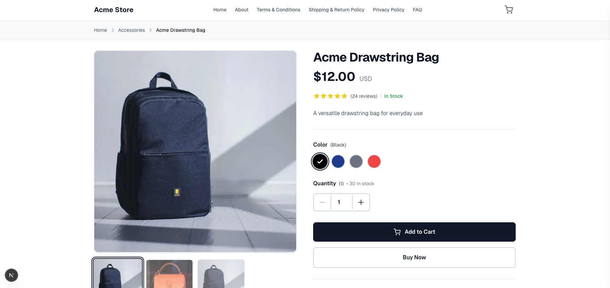

# Next.js E-commerce Store

A modern, full-featured e-commerce application built with Next.js 16, TypeScript, and Stripe integration. This project demonstrates a complete online shopping experience with product catalog, shopping cart, and secure checkout functionality.




## ✨ Features

- 🛍️ **Product Catalog** - Browse products by category with beautiful grid layouts
- 🎨 **Product Details** - Detailed product pages with image galleries, color/size options, and quantity selection
- 🛒 **Shopping Cart** - Persistent cart with sidebar interface
- 💳 **Stripe Integration** - Secure payment processing with Stripe Checkout
- 📱 **Responsive Design** - Mobile-first design built with Tailwind CSS
- ⚡ **Performance** - Optimized with Next.js App Router and React Server Components
- 🎯 **TypeScript** - Fully typed for better developer experience
- 🔍 **Product Search & Filtering** - Filter products by category

## 🚀 Tech Stack

- **Framework:** [Next.js 16](https://nextjs.org/) with App Router
- **Language:** [TypeScript](https://www.typescriptlang.org/)
- **Styling:** [Tailwind CSS](https://tailwindcss.com/)
- **Payment:** [Stripe](https://stripe.com/)
- **Icons:** [React Icons](https://react-icons.github.io/react-icons/)
- **React:** React 19

## 📋 Prerequisites

Before you begin, ensure you have the following installed:

- Node.js 18+ 
- npm or yarn
- A Stripe account (for payment processing)

## 🛠️ Installation

1. **Clone the repository**
   ```bash
   git clone <your-repo-url>
   cd next-js-ecommerce
   ```

2. **Install dependencies**
   ```bash
   npm install
   # or
   yarn install
   ```

3. **Set up environment variables**
   
   Create a `.env.local` file in the root directory:
   ```env
   STRIPE_SECRET_KEY=your_stripe_secret_key
   NEXT_PUBLIC_STRIPE_PUBLISHABLE_KEY=your_stripe_publishable_key
   ```

4. **Run the development server**
   ```bash
   npm run dev
   # or
   yarn dev
   ```

5. **Open your browser**
   
   Navigate to [http://localhost:3000](http://localhost:3000)

## 🔧 Environment Variables

| Variable | Description | Required |
|----------|-------------|----------|
| `STRIPE_SECRET_KEY` | Your Stripe secret key from the Stripe Dashboard | Yes |
| `NEXT_PUBLIC_STRIPE_PUBLISHABLE_KEY` | Your Stripe publishable key | Yes |

## 📁 Project Structure

```
next-js-ecommerce/
├── src/
│   ├── app/                    # Next.js App Router pages
│   │   ├── api/               # API routes
│   │   │   └── checkout/      # Stripe checkout endpoint
│   │   ├── checkout/          # Checkout pages
│   │   ├── product/           # Product detail pages
│   │   └── page.tsx           # Home page
│   ├── components/            # React components
│   │   ├── CartSidebar.tsx   # Shopping cart sidebar
│   │   ├── Header.tsx         # Site header
│   │   ├── Footer.tsx         # Site footer
│   │   ├── ProductCard.tsx   # Product card component
│   │   └── ...               # Other components
│   ├── contexts/              # React contexts
│   │   └── CartContext.tsx   # Shopping cart state management
│   ├── data/                  # Static data
│   │   └── products.ts       # Product catalog
│   ├── lib/                   # Utility libraries
│   │   └── stripe.ts         # Stripe configuration
│   └── types/                 # TypeScript type definitions
│       ├── product.ts         # Product types
│       └── cart.ts           # Cart types
├── public/                    # Static assets
└── package.json
```

## 🎯 Key Features Explained

### Shopping Cart
- Add/remove products
- Update quantities
- Persistent cart state using React Context
- Sidebar cart interface

### Product Pages
- Image galleries with thumbnails
- Color and size selection
- Stock availability
- Quantity selector
- Add to cart and buy now actions

### Checkout Flow
- Secure Stripe Checkout integration
- Success and cancel pages
- Order confirmation

## 🚀 Deployment

### Build for Production

```bash
npm run build
npm start
```

### Deploy to Vercel

The easiest way to deploy this Next.js app is to use [Vercel](https://vercel.com):

1. Push your code to GitHub
2. Import your repository on Vercel
3. Add your environment variables
4. Deploy!

## 📝 Available Scripts

- `npm run dev` - Start development server
- `npm run build` - Build for production
- `npm start` - Start production server
- `npm run lint` - Run ESLint

## 🤝 Contributing

Contributions are welcome! Please feel free to submit a Pull Request.

## 📄 License

This project is open source and available under the [MIT License](LICENSE).

## 🙏 Acknowledgments

- Built with [Next.js](https://nextjs.org/)
- Payment processing by [Stripe](https://stripe.com/)
- Styled with [Tailwind CSS](https://tailwindcss.com/)

---

Made with ❤️ using Next.js

